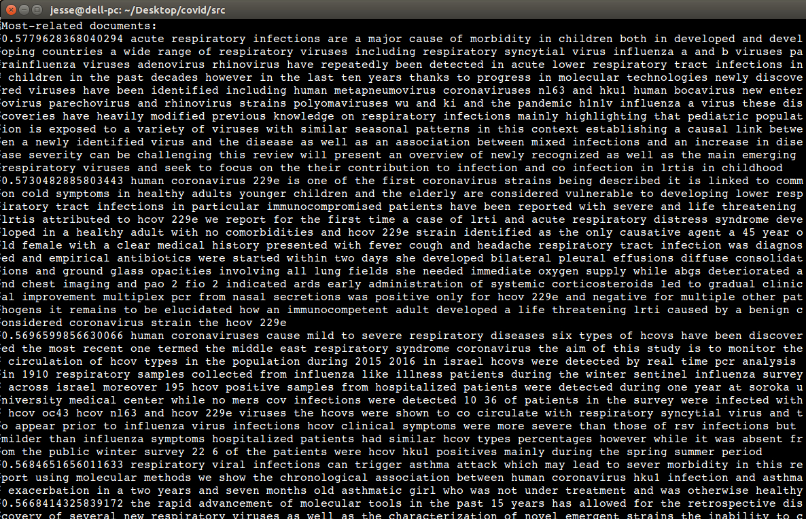

In the example shown below, a Word2Vec model was trained, then used to convert COVID-19 documents into vectors
to perform vector-based user queries. The query terms were "coronavirus pneumonia".
The similarity/scoring mechanism is simply to calculate the cosine similarity of the query terms w.r.t. each document.
Theoretically, the documents do not need to include the query terms for recall, since the scoring is done in this inner product space.
The score is shown, followed by the document's abstract.

