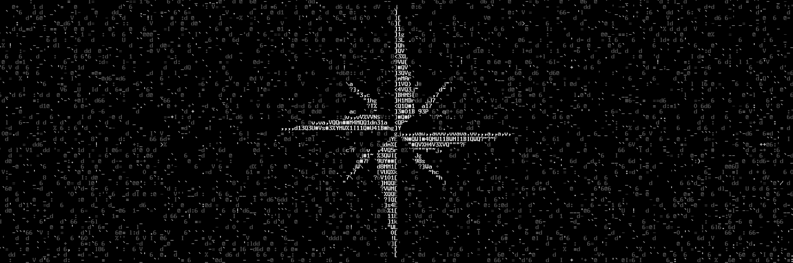

This is a prototyping repo of text-mining and search methods developed for the COVID-19 dataset from the Allen Ai institute.
Evaluation/tasks are still forthcoming from the Kaggle, but most of the problems seem less like ML than like SWE:
* what use cases address the needs of COVID researchers
* what generic search platforms or frameworks can get them information as rapidly as possible

This repo is purely a demonstration of the use of vector-space language modeling using gensim to support the following use cases:
* semantic keyword search:
  * ranking relevant research papers using document vectors
  * 'also see...' suggestions
  * user parameterized search: letting researchers find documents based on their own criteria, e.g. not tech exec's criteria.
* knowledge/expert mapping:
  * graphical modeling of author expertise using language modeling. Essentially, given author X, link other author's whose language is most similar.
  * navigation/search of the expert-graph
  * knowledge-cluster identification

Despite the seriousness of covid, these are fascinating topics, and easily implemented/supported by vector-space neural modeling methods like Gensim and others.

Links:
* https://www.kaggle.com/allen-institute-for-ai/CORD-19-research-challenge/tasks
* https://www.whitehouse.gov/briefings-statements/call-action-tech-community-new-machine-readable-covid-19-dataset/
* https://pages.semanticscholar.org/coronavirus-research

To use the repo in its current state:
1) Download the COVID-19 commercial use dataset to the dataset/ folder: dataset/comm_use_dataset/*
2) Cd into src/ and run: python3 covid.py
This will build a gensim Word2Vec language model, and save it to the models/ folder.
Once built, the entire dataset is read into memory (got RAM?), each paper is converted to a document vector by averaging
all of its terms. A query loop then accepts input terms from the user, and returns the most similar terms/documents 
per the query using cosine-similarity.

Also, contrary to popular belief, COVID-19 is *not the end of the world* if we inspire confidence in others, think positive, and look for ways to contribute. [Cheers](https://www.youtube.com/watch?v=cCYGyg1H56s).

